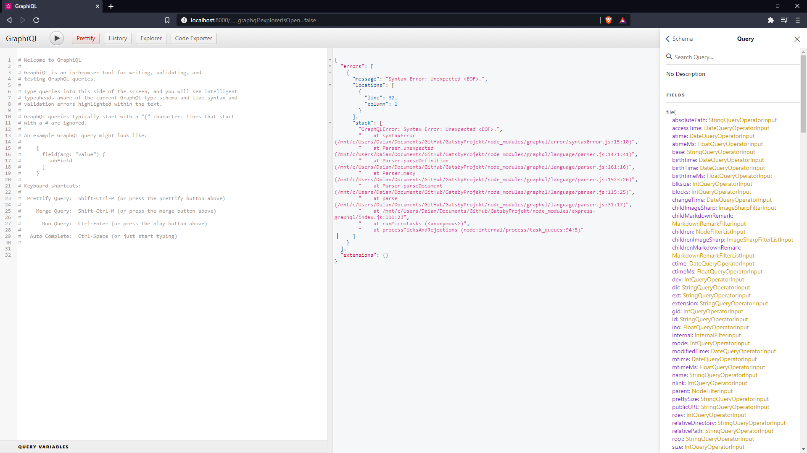
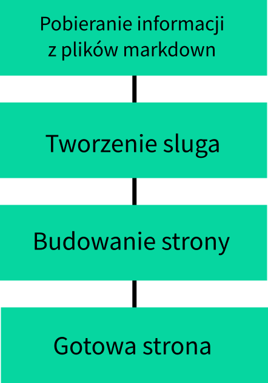
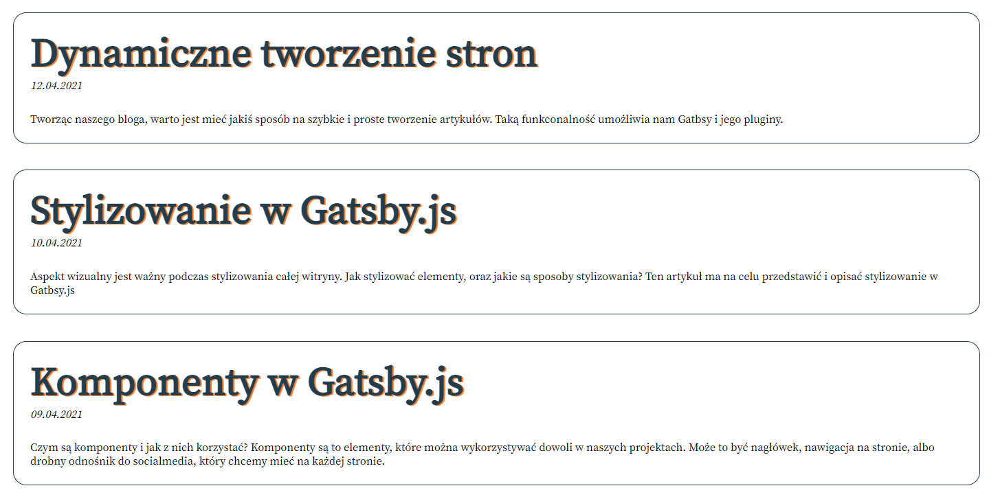

<article class='article'>

<blockquote class="article__tableofcontent"> 
    <h3>
    	Spis treści
    </h3>
    <ul>
        <li>
            <a href="#post1">
                GraphQL - co to jest i jak się tego używa
            </a>
        </li>
        <li>
		    <a href="#post2">
		    Pliki Markdown i ich tworzenie
		    </a>
	    </li>
        <li>
            <a href="#post3">
                Dynamiczne tworzenie stron
            </a>
        </li>
   </ul>
</blockquote>

<div class="article__content">

<h2 id="post1">GraphQL - co to jest i jak się tego używa</h2>

__GraphQL__ jest to sposób komunikowania się z serwerem API. Cechuje się tym, że występuje tutaj jeden adres pod którym są dane, a&nbsp;dostęp do nich zależy od zapytania, które skonstruujemy.  
Korzystając z graphQL dostępny jest dla nas "*Plac zabaw*", na którym możemy tworzyć zapytania, a następnie je wykorzystać je w&nbsp;kodzie strony.


*okno graphql*   

Narzędzie to jest wyposażone w&nbsp;dokumentację, która zawiera informacje o&nbsp;możliwych zapytaniach, dzięki czemu możemy dowolnie układać zapytania w&nbsp;zależności od naszych potrzeb.   
Przykładowe zapytanie wygląda następująco:

```jsx
const data = useStaticQuery(graphql`
        query {
            site {
                siteMetadata{
                    title
                }
            }
        }
    `)
```

Wyżej wymienione zapytanie wykorzystywane jest w nagłówku strony. Wyszukuje on <span>`title`</span> strony, o którym informacje znajdują się w&nbsp;<span>`gatsby-config.js`</span>

```JS
module.exports = {
  siteMetadata: {
    title: "Serverless Adventure",
  },
```


<h2 id="post2">Pliki Markdown i ich tworzenie</h2>

Spotykamy się z&nbsp;nimi głównie na [Githubie](https://github.com/), przeglądając najróżniejsze repozytoria. Wykorzystywane są także w&nbsp;najróżniejszych dokumentacjach.   
Co umożliwia markdown?
Pozwala nam on na proste i szybkie stylizowanie tekstu, bez potrzeby tworzenia dodatkowych klas, arkuszy styli itp. Składnia jest prosta i&nbsp;intuicyjna - nauczenie się jej nie zajmuje wiele czasu. Dzięki temu pisanie artykułów przy użyciu markdown'a jest znacznie łatwiejsze i&nbsp;szybsze. Nie wymaga on od nas ustawiania styli, zaznaczania tekstu, który ma być nagłówkiem. Wszystko sprowadza się do odpowiednich kombinacji znaków.  


*Ściąga składni markdown wykonana przez CODE2BITS   
Strona jest niestety nie dostępna   
[link do polskiej wersji](https://pl.wikipedia.org/wiki/Markdown)*

Jak widać na załączonym obrazku składnia nie należy do tych skomplikowanych.

<h2 id="post3">Dynamiczne tworzenie stron</h2>

Dynamiczne tworzenie stron, czyli przyśpieszenie tworzenia naszego bloga. Czynność, która jest bardzo praktyczna dla osób chcących łatwo i&nbsp;prosto móc tworzyć artykuły, bez dodatkowego stylizowania - dodawania klas etc.   

Proces ten nie należy do skomplikowanych, ale jego poprawne skonfigurowanie należy do tych wymagających większego kombinowania. Na początku pobierane są informacje o&nbsp;plikach, z&nbsp;których pobierane będą informacje. Z&nbsp;tych informacji tworzony jest tak zwany <i id="slug">__slug__</i> - jest ciąg znaków, który jest zawarty w&nbsp;linku strony. Jest to unikalny identyfikator dla konkretnych zasobów.  
W przypadku plików markdown jest on tworzony od nazw plików. W&nbsp;wyniku tego ważnym jest odpowiednie nazywanie plików.  
W&nbsp;kolejnym etapie jest proces build'a, podczas którego pobierana jest zawartość plików markdown i&nbsp;umieszczana jest na przez nas wcześniej utworzonym szablonie strony.



Z rzeczy, które będą nam potrzebne to:

* pluginy - <span>`gatsby-source-filesystem, gatsby-tranformer-remark, gatsby-plugin-sharp, gatsby-remark-relative-images, gatsby-remark-images`</span>
* dowolne pliki markdown - warto jest mieć najpierw sam zarys, żeby móc sprawdzać i&nbsp;testować ich działanie
* szablon dla artykułów

I tak naprawdę to jest wszystko co jest nam do szczęścia potrzebne.
Pierwszym krokiem jaki trzeba wykonać to skonfigurować pluginy. W&nbsp;pliku <span>`gatsby-config.js`</span> wystarczy umieścić ten tego typu kod:

```JS
    {
      resolve: 'gatsby-source-filesystem',
      options: {
        name: `src`,
        path: `${__dirname}/src/`,
      }
    },
    'gatsby-plugin-sharp',
    {
      resolve: 'gatsby-transformer-remark',
      options: {
        plugins: [
          'gatsby-remark-relative-images',
          {
            resolve: 'gatsby-remark-images',
            options: {
              //maxWidth jest to maksymalna szerokość zdjęcia
              maxWidth: 750,
              linkImagesToOriginal: false
            }
          },
        ]
      }
    },
```

Jest to konfiguracja potrzebnych nam pluginów. 

> Adnotacja do dokładniejszych informacji o&nbsp;pojedyńczych pluginów na&nbsp;stronie ich dokumentacji:
> * [gatsby-source-filesystem](https://www.gatsbyjs.com/plugins/gatsby-source-filesystem/)
> * [gatsby-plugin-sharp](https://www.gatsbyjs.com/plugins/gatsby-plugin-sharp)
> * [gatsby-tranformer-remark](https://www.gatsbyjs.com/plugins/gatsby-transformer-remark/)
> * [gatsby-remark-relative-images](https://www.gatsbyjs.com/plugins/gatsby-remark-relative-images/)
> * [gatsby-remark-images](https://www.gatsbyjs.com/plugins/gatsby-remark-images/)

Następnie potrzebujemy upewnić się, że nasze pliki markdown są tak samo wykonane. Chcąc mieć informacje, według których nasze posty powinny być wyszukiwane należy umieścić na początku pliku tablę:

```
---
title: "tytuł strony"
date: "data artykułu format => YYYY-MM-DD"

---
```

> Informacje w tej tabeli można wyszukać przy użyciu graphQL - ważne jest, żeby składnia wyglądała tak: <span>`zmienna: "wartość"`</span>. 

Na stronie, na której ma być wyświetlana lista artykułów, trzeba zaimportować:
<span>`graphql, useStaticQuery z 'gatsby'`</span>. Pozwoli to nam na tworzenie zapytań, które umożliwią nam wyszukiwanie informacji o&nbsp;plikach markdown. Dzięki tym zapytaniom będziemy mogli stworzyć listę artykułów, a dzięki temu utworzyć nawigację na naszej stronie.

```JSX
import React from 'react'
import { graphql, useStaticQuery } from gatsby

const Blog = () => {
  
  //statyczne zapytanie graphql

  const data = useStaticQuery(graphql`
    query {
      allMarkdownRemark{
        edges{
          node{
            frontmatter{
              title
              date
            }
          }
        }
      }
    }
  `)

  return (
    //Tworzenie listy artykułów

    <div>
      <ul>
        {
          data.allMarkdownRemark.edges.map((edge) =>(
            <li>
              <article>
                <h2>{edge.node.frontmatter.title}</h2>
                <p>{edge.node.frontmatter.date}</p>
              </article>
            </li>
          ))
        }
      </ul>
    </div>

  )
}
```

Na tej stronie stworzone zapytanie wyszukuje _frontmatter_ - są to wszystkie informacje, które znajdują się w&nbsp;tej tabelce, którą tworzyliśmy na początku pliku markdown. Dlatego też ważnym jest umieszczanie tych samych "_zmiennych_" we&nbsp;wszystkich plikach markdown.  

```
<div>
  <ul>
    {
      data.allMarkdownRemark.edges.map((edge) =>(
        <li>
          <article>
            <h2>{edge.node.frontmatter.title}</h2>
            <p>{edge.node.frontmatter.date}</p>
          </article>
        </li>
      ))
    }
  </ul>
</div>
```

Fragment ten odpowiada za&nbsp;tworzenie elementów html, których zawartością będą informacje, które zostały wyszukane w&nbsp;zapytaniu, które wczęśniej tworzyliśmy.  



W&nbsp;przypadku tej witryny lista artykułów zawiera także wstęp do&nbsp;artykułu. Chcąc jednak utworzyć linki do&nbsp;tych podstron potrzebny nam będzie szablon strony oraz wcześniej wymieniony <a href="#slug">_slug_</a>. Aby móc go stworzyć będziemy potrzebować utworzyć plik <span>`gatsby-node.js`</span>.   
W tym pliku będziemy musieli utworzyć dwie funkcje: jedna odpowiada za&nbsp;tworzenie sluga, a&nbsp;druga za&nbsp;bezpośrednie tworzenie stron. Zanim to wykonamy potrzebować jeszcze będziemy szablonu strony.   
Jego stworzenie, nie należy do ciężkich. Wpierw musimy utworzyć zapytanie graphql, które będzie dynamiczne, więc nie będziemy potrzebować <span>`useStaticQuery`</span>. Będzie ono się wykonywać dla każdego sluga, który jest stringiem - ma to na celu uniknięcia błędów, gdyby slug był liczbą. Następnie będzie wyszukiwać informacje, które należą do sluga, który dotyczy aktualnej strony.   
Później umieści wyszukane informacje: tytuł i datę, w&nbsp;odpowiednie pola. Treść poza tabelą w pliku markdown jest interpretowana jako HTMl, więc należy go umieścić w jakimś kontenerze przy użyciu <span>`dangerouslySetInnerHTML`</span>.   

```JSX
import React from 'react'
import { graphql } from 'gatsby'

export const query = graphql`
  query($slug: String!) {
        markdownRemark(fields: { slug: { eq: $slug } }) {
            frontmatter {
                title
                date
            }
            html
        }
  }
`

const Blog = (props) => {
  return (
    <div>
      <h2>
        {props.data.markdownRemark.frontmatter.title}
      </h2>
      <p>
        {props.data.markdownRemark.frontmatter.title}
      </p>
      <div dangerouslySetInnerHTML={{ __html: props.data.markdownRemark.html}}>
      </div>
    </div>
  )
}
```
  
Po utworzeniu szablonu następnym krokiem jest tworzenie sluga. Chcąc utworzyć sluga musimy stworzyć zmienną, która będzie wykorzystywać <span>`path`</span>. Dzięki temu będziemy mogli użyć jej w&nbsp;celu wyszukiwania plików w&nbsp;naszych funkcjach. Następnie wykorzystujemy API Gatsby.js <span>`onCreateNode`</span>. Ta funkcja będzie się wykonywała za każdym razem gdy będzie tworzony nowy node (struktura danych) lub będzie on aktualizowany.

```JS
const path = require('path')

module.exports.onCreateNode = ({ node, actions }) => {
    const { createNodeField } = actions

    if (node.internal.type === 'MarkdownRemark') {
        const slug = path.basename(node.fileAbsolutePath, '.md')

        createNodeField({
            node,
            name: 'slug',
            value: slug
        })
    }
}
```
Powyższy kod będzie tworzył slug'a tylko dla node'ów MarkdownRemark - innymi słowy, tylko dla plików markdown w katalogach, które wcześniej zdeklarowaliśmy w&nbsp;ustawieniach <span>`gatsby-source-filesystem`</span>.   
Zanim je stworzy jednak "ucina" rozszerzenie, dzięki czemu ma tylko nazwę pliku. 

Kolejnym krokiem jest stworzenie funkcji, która będzie tworzyć strony. Wykorzystamy do tego <span>`createPage`</span>.  
Chcąc ją wykorzystać, należy użyć kodu, który jest poniżej.

```JS
module.exports.createPages = async ({ graphql, actions }) => {
const { createPage } = actions
const blogTemplate = path.resolve('./src/templates/blogtemp.js')
const res = await graphql(`
    query {
        allMarkdownRemark{
            edges {
                node {
                    fields{
                        slug
                    }
                }
            }
        }
    }
`)
res.data.allMarkdownRemark.edges.forEach((edge)=>{
    createPage({
        component: blogTemplate,
        path: `/blog/${edge.node.fields.slug}`,
        context: {
            slug: edge.node.fields.slug,
        }
    })
})
}
```

Ten kod pobiera szablon strony, a następnie tworzy strony, na bazie informacji, które zostały pobrane w&nbsp;zapytaniu graphql.  

##### Aktualizacja strony z artykułami

Gdy mamy już utworzone strony w&nbsp;kodzie strony z&nbsp;artykułami musimy utworzyć odnośniki. 

```JSX
import React from 'react'
import { Link, graphql, useStaticQuery } from gatsby

const Blog = () => {

  const data = useStaticQuery(graphql`
    query {
      allMarkdownRemark{
        edges{
          node{
            frontmatter{
              title
              date
            }
          }
        }
      }
    }
  `)

  return (
    <div>
      <ul>
        {
          data.allMarkdownRemark.edges.map((edge) =>(
            <li>
            <Link to={`/blog/${edge.node.fields.slug}`}>
              <article>
                <h2>{edge.node.frontmatter.title}</h2>
                <p>{edge.node.frontmatter.date}</p>
              </article>
              </Link>
            </li>
          ))
        }
      </ul>
    </div>

  )
}
```
Aktualnie jesteśmy w stanie zajrzeć na strony pojedyńczych artykułów.

</div>

</article>
