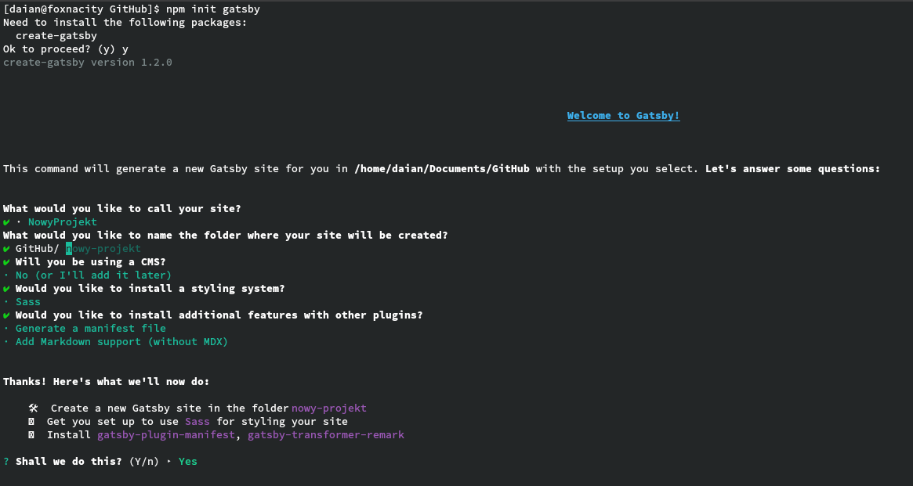

<article class='article'>

<blockquote class="article__tableofcontent"> 
    <h3>
    	Spis treści
    </h3>
    <ul>
        <li>
            <a href="#post1">
                Tworzenie nowego projektu
            </a>
        </li>
        <li>
            <a href="#post2">
                Stworzenie strony głównej
            </a>
        </li>
    </ul>
</blockquote>


<div class="article__content">

Gatsby już zainstalowany, to można rozpocząć przygodę z&nbsp;tym frameworkiem   
Naszym głównym celem w tym artykule będą:

* Stworzenie projektu
* Stworzenie strony głównej


<h2 id="post1">
    Tworzenie nowego projektu
</h2>


Stworzenie nowego projektu jest banalnie proste. Wystarczy do tego jedno polecenie i&nbsp;gatsby poprowadzi nas przez cały tworzenia projektu.   
    

```Shell

npm init gatsby
```

Po uruchomieniu tego polecenia rozpocznie się proces tworzenia projektu, podczas którego:

* nazwiemy nasz projekt, 
* utworzymy katalog, 
* określimy czy chcemy używać CMS - systemu zarządzania treścią na serwisie internetowym np. Wordpress.
* wybierzemy system stylizowania - ja wybrałem Sass'a
* oraz wybierzemy dodatkowe pluginy z niewielkiej listy, które będa doinstalowane podczas tworzenia projektu



<h2 id="post2">
    Tworzenie strony głownej
</h2>


Po utworzeniu projektu, wystarczą nam dwa polecenia, żeby móc zacząć tworzyć naszą witrynę:

```Shell    
    
cd nazwa-projektu
npm run develop
```

Dzięki drugiemu poleceniu uruchomimy localny serwer, na którym będzie nasza strona funkcjonowała.   
Dostaniemy się do niej dzięki wpisaniu w wyszukiwarkę <span>localhost:8000</span>, a&nbsp;naszym oczom ukaże się poniższy widok.


Jak widać widać jest to gotowy szablon z&nbsp;odnośnikami do poradników i&nbsp;dokumentacji. Zapisany jest w pliku index.js, który jest w katalogu <span class="file_path">./src/pages/</span>. Chcąc jednak zrobić samodzielnie stronę, nasz plik musi wyglądać w&nbsp;ten sposób:

```JSX 
    
import React from 'react'

const Index = () => {
  return (
    // zawartość strony
    // zawartość strony
    // zawartość strony
    // zawartość strony
    // zawartość strony
    // zawartość strony
  )
}

export default Index
```

W miejscu zawartości musi być jakiś kontener, w którym będzie całość zamieszczona. Może to być zaimportowany komponent, lub znacznik html np. <span>`<div></div>`</span>. Pod tym względem mamy pełną dowolność.     

Należy uważać, żeby nie umieszczać dwóch kontenerów obok siebie:

```JSX
    
import React from 'react'

const Index = () => {
    return (
    	<div>
        	// zawartość strony
        </div>,
        <div>
        	// zawartość strony
        </div>
    )
}
```

Tego typu sytuacja, będzie powodować błędy. Sposobem, żeby unikać tego typu sytuacji są komponenty, które są opisane w kolejnym artykule.

</div>

</article>