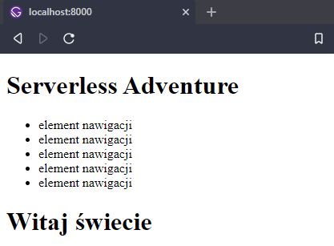
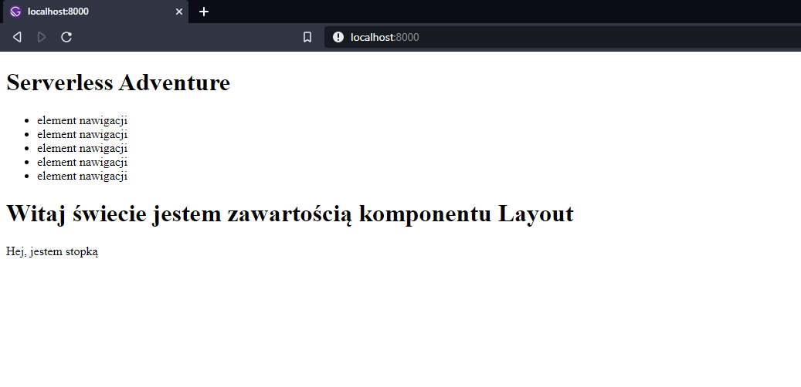

<article class='article'>

<blockquote class="article__tableofcontent"> 
    <h3>
    	Spis treści
    </h3>
    <ul>
        <li>
            <a href="#post1">
                Czym są komponenty?
            </a>
        </li>
        <li>
            <a href="#post2">
                Jak tworzyć komponenty?
            </a>
        </li>
        <li>
            <a href="#post3">
                Zagnieżdżanie komponentów
            </a>
        </li>
    </ul>
</blockquote>

<div class="article__content">

<h2 id="post1">Czym są komponenty?</h2>

Komponenty są to elementy naszej strony, których zastosowanie jest dowolne - to jaka będzie jego funkcja jest zależne od nas.  
Chcąc podać przykład takie komponentu może być to pasek na górze z&nbsp;nazwą strony, oraz odnośnikami do sekcji *blog* i *o autorze*. Niezależnie od tego na, której stronie będziemy on zawsze będzie taki sam. To samo tyczy się stopki, czyli tego tam na dole, które mówi o tym, że jestem autorem strony.   
Inny przykład? Każda strona ma swoje metadane, które znajdują się w znaczniku <span>`head`</span>. W Gatsby.js nie ma bezpośrednio takiego znacznika, trzeba zainstalować komponent <span>`react-helmet`</span>, który pozwala na zarządzanie takimi znacznikami jak: <span>`title`,`base`, `meta`, `link`, `script`, `noscript` i `style`</span>. Jak już będziemy go posiadać wystarczy stworzyć komponent, w którym będą wszystkie te informacje, a następnie importować go do stron.    
W tym miejscu też ukazała się zaleta komponentów: dzięki temu, że możemy je importować, zmiany, które wprowadzimy w jednym komponencie będą od razu widoczne na wszystkich stronach.

<h2 id="post2">Tworzenie komponentów</h2>

Chcąc tworzyć komponenty najpierw należy stworzyć osobny folder, w którym będziemy mogli przechowywać stworzone komponenty, a dzięki temu odnalezienie ich będzie wręcz dziecinnie proste.

>Jeśli będziemy używać dużej ilości elementów np. zdjęć, w jednym komponencie, warto jest utworzyć jeszcze kolejny katalog dla tego komponentu, gdzie wszystkie potrzebne pliki będą w jednym miejscu.

Następnie tworzymy plik js, który będzie naszym komponentem.   
Jako przykład stworzymy nagłówek, który będzie widoczny u góry strony:

```JSX 
import React from 'react'
	
const Header = () => {
	return (
		<header>
			<h1>Serverless Adventure</h1>
			
			<ul>
			<li> element nawigacji</li>
			<li> element nawigacji</li>
			<li> element nawigacji</li>
			<li> element nawigacji</li>
			<li> element nawigacji</li>
			</ul>
		</header>
	)
}	
export default Header
```

Następnie wystarczy go zaimportować go do naszej strony, dodając jedną linijkę:

```JSX
import Header from "sciezkapliku/header.js"
```

Chcąc go użyć w samej stronie dodać taką linijkę kodu:

```JSX
import React from  'react'
import Header from  '../components/header.js'

const  Index  = () => {
	return (
		<div>
			<Header  /> //!
			<h2>
				Witaj świecie
			</h2>
		</div>
	)
}

export  default  Index
```

To umieści nam nasz nagłówek na stronie

 
 <h2 id="post3">Zagnieżdżanie komponentów</h2>

Biorąc pod uwagę to, że wykorzystywanie zaimportowanych komponentów  sprowadza się do umieszczenia ich w&nbsp;postaci znacznika, możemy je zagnieżdżać ze sobą. W przykładowej sytuacji mamy dwa komponenty <span>`header` i&nbsp;`footer`</span>. Chcemy stworzyć komponent, który będzie łączył te dwa ze sobą, i umożliwiał przy tym umieszczanie zawartości na stronie.    
Pierwszym krokiem jest utworzenie struktury pliku: 

```JSX 
import React from 'react'
import Header from 'sciezkadopliku/header.js'
import Footer from 'sciezkadopliku/footer.js'

const Layout = () => {
	return (

	)
}
export default Layout
```

W tym momencie przychodzi zasadnicze pytanie: *Jak to zrobić?*   
Odpowiedź jest nie, aż tak prosta jak się może wydawać. Fakt umieszczenie znaczników <span>`Header` i&nbsp;`Footer`</span> nie jest ciężkie, ale dostosowanie komponentu, aby ten mógł przyjmować jakąś zawartość. Informacją, która jest dla nas przydatna jest fakt, że komponenty przyjmują i przechowują dany zestaw własności - ang. *properties*. Chcąc ich użyć, należy je podać jako argument funkcji, a następnie wykorzystać jedną z tych własności - dokładniej mówiąc <span>`children`</span>

```JSX
const Layout = (props) => {
	return (
	<div>
	<Header />
	{props.children}
	<Footer />
	</div>
	)
}	
```
Następnie wystarczy wprowadzić zmiany na naszych stronach.
```JSX
import React from  'react'
import Layout from  '../components/layout'

const  Index  = () => {
	return (
		<Layout>
			<h1>Witaj świecie jestem zawartością komponentu Layout</h1>
		</Layout>
	)
}
export  default  Index
```



Jak widać na powyższym zdjęciu wszystko jest sprawne i&nbsp;działa. Teraz wystarczy tworzyć kolejne komponenty, oraz następne strony.

</div>

</article>