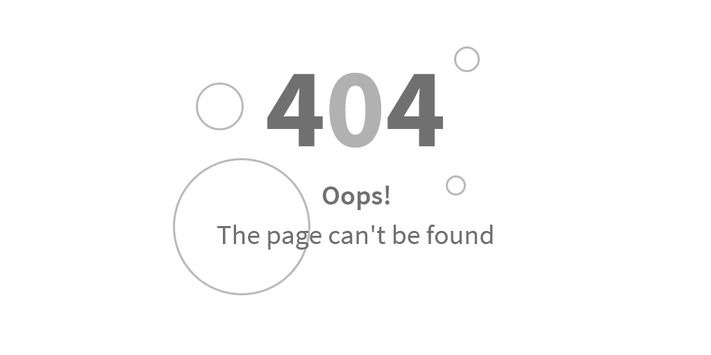
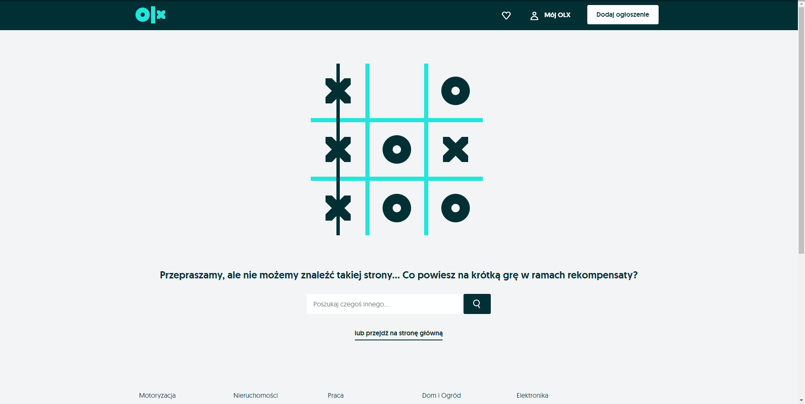
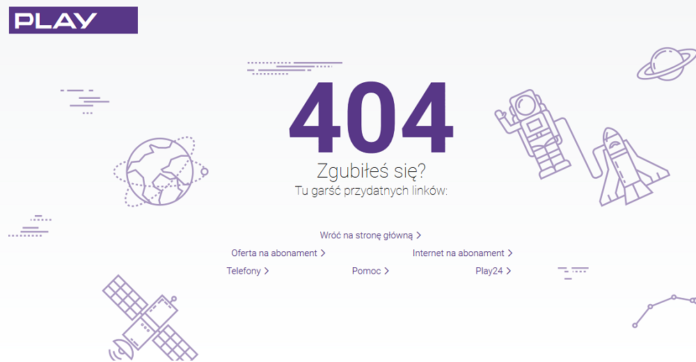
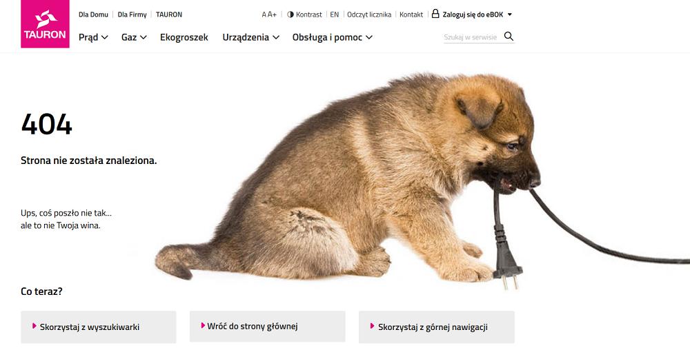

<article class='article'>

<blockquote class="article__tableofcontent"> 
    <h3>
    	Spis treści
    </h3>
    <ul>
        <li>
            <a href="#post1">
                Czym jest błąd 404?
            </a>
        </li>
        <li>
            <a href="#post2">
                Jakie jest zdanie strony 404?
            </a>
        </li>
    </ul>
</blockquote>

Znacie to uczucie, gdy przeglądając internet chcecie wejść na stronę internetową, ale tej strony nie ma i&nbsp;trafiacie na stronę, która informuje was o&nbsp;tym, że *Wasza strona nie została znaleziona, lub też nie istnieje* ? Ta strona, która nas wita to jest właśnie tytułowa strona 404. Czym ona jest i&nbsp;dlaczego się pojawia?

<h2 id="post1">Czym jest błąd 404?</h2>

Błąd 404 jest to błąd, który występuje, gdy użytkownik chce się dostać na daną stronę, ale w&nbsp;momencie przesyłu zapytań na lini użytkownik-serwer wystąpią jakiekolwiek błędy wyświetli się komunikat typu "_Error 404: website not found_".  

Co oznacza samo 404? Każda liczba w tym kodzie ma swoje dokładne znaczenie:
* pierwsza 4 - błąd popełniony przez użytkownika. Występuje, gdy błędnie wpiszemy adres strony, lub będziemy się chcieli dostać na stronę, która nie istnieje.
* 0 - błąd składniowy
* ostatnia 4 - brak żądanego celu

Jak można zauważyć znaczenie kodu jest bardzo adekwatne do jego występowania.

<h2 id="post2">Jakie jest zadanie strony 404?</h2>

Jednym z głównych celów jest poinformowanie użytkownika o&nbsp;zaistniałej sytuacji, jej powodach oraz możliwych rozwiązaniach. Dzięki temu możemy przekształcić negatywne emocje w&nbsp;pozytywne. Często posiadają także jakąś formę nawigacji - odnośnik do strony głównej i&nbsp;innych podstron, lub pełnoprawną wyszukiwarkę witryny.   
W sytuacji, gdy chcemy zatrzymać odwiedzającego, nasza własna strona 404 jest elementem, który przekona użykownika do dalszego przeglądania naszej witryny.

Poniżej prezentuję wam strony 404 z&nbsp;polskich stron, które bardzo dobrze spełniają swoją rolę pod względem wizualnym jak i&nbsp;merytorycznym.

Oczywiście nasza witryna też jest wyposażona w&nbsp;strone 404. 
[Odnośnik na stronę 404](https://foxnacity.github.io/GatsbyProjekt/404)

</article>