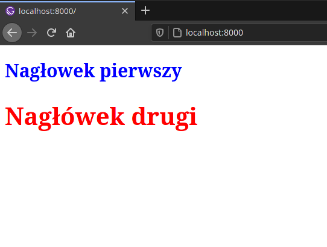
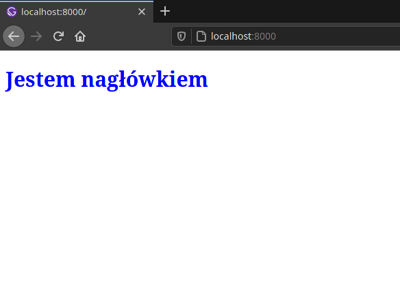

<article class='article'>

<blockquote class="article__tableofcontent"> 
    <h3>
    	Spis treści
    </h3>
    <ul>
        <li>
            <a href="#post1">
                Jak stylizować?
            </a>
        </li>
        <li>
            <a href="#post2">
                Modularne arkusze styli w praktyce
            </a>
        </li>
        <li>
		<a href="#post3">
		Css w JS
		</a>
	</li>
   </ul>
</blockquote>

<div class="article__content">

<h2 id="post1">Jak stylizować</h2>

Aspekt wizualny jest ważny podczas stylizowania całej witryny. Jak stylizować elementy, oraz jakie są sposoby stylizowania?   
Chcąc mówić o stylizowaniu warto wymienić sposoby stylizacji jakie są możliwe w Gatsby.js. W&nbsp;[dokumentacji](https://gatsbyjs.com/docs/styling) są wymienione trzy opcje:
* __Globalne pliki CSS__ - klasyczne stylizowanie, które jest spotykane wszędzie. Sprowadza się to do tego, że mamy jeden lub kilka plików css, które są używane na wszystkich stronach i&nbsp;podstronach.
*  __Modularne arkusze styli__ - są to zwykłe pliki css, które pozwalają nam na wykorzystywanie tych samych nazw w kilku różnych arkuszach styli. Są domyślnie wspierane przez Gatsby.js i&nbsp;nie wymagają dodatkowych pluginów. Ich opis w praktyce jest <a href="#post2">w dalszej części artykułu</a>
*  __Css w JS__ - chcąc to najprościej wytłumaczyć jest to tworzenie arkuszy styli bezpośrednio w&nbsp;Javascript. Pozwala to nam na tworzenie od razu stylizowanych komponentów, bez potrzeby tworzenia dodatkowych plików css. Do działania zalecane są dodatkowe biblioteki, dla ułatwienia procesu stylizowania elementów.

<h2 id="post2">Modularne arkusze styli w praktyce</h2>

Chcąc wytłumaczyć czym się cechują modularne arkusze styli trzeba wymienić kilka rzeczy. Pierwszą jest to, że&nbsp;rozszerzenie tych plików to <span>`.module.*`</span>, gdzie * odpowiada za to jakie rozszerzenie mają zwykłe arkusze styli, bo przykładowo można było wykorzystać [Sassa](https://sass-lang.com/), a przez to nasze pliki by miały rozszerzenie <span>`.scss` i `.sass`</span>.  
Wracając do głównego wątku - modularne arkusze styli pozwalają nam na powielanie tych samych klas na naszej stronie. W jaki sposób to działa?   
Działa to na prostej zasadzie: załóżmy, że mamy dwa pliki <span>`blueheader.module.css` oraz `redheader.module.css`</span>. U obu kod wygląda następująco:

```Css
//blueheader.module.css
.header{
	color: blue;
	font-size: 30px;
}
```
```Css
//redheader.module.css
.header {
	color: red;
	font-size: 40px;
}
```
Jak widać w obu plikach wykorzystywana jest taka sama nazwa klasy, jednak pomimo tego będziemy w stanie wykorzystać to na naszej stronie bez większych problemów. Dlaczego?
Odpowiedź można odnaleźć już w tym jak importowane są modularne arkusze styli do strony.

```JSX
import React from 'react'
import * as bluestyles from 'sciezkadopliku/blueheader.module.css'
import * as redstyles from 'sciezkadopliku/redheader.module.css'

const Index = () => {
	return (
	<div>
		<h1 className={bluestyles.header}>Nagłowek pierwszy </h1>
		<h1 className={redstyles.header}>Nagłówek drugi </h1>
	</div>
	)
}

export default Index
```

Jak można zauważyć z modułów importowane jest wszystko, z wybranym przez nas aliasem. W wyniku tego gdy nasze strony są tworzone w procesie budowania, naszym elementom są nadawane dynamiczne klasy css, które wyglądają podobnie 
do&nbsp;<span>`bluestyles-module--header`&nbsp;i&nbsp;`redtyles-module--header`</span>. Dzięki czemu nie występują problemy spowodowane powtarzającymi się klasami. 



<h2 id="post3">Css w JS</h2>

Alternatywą dla importowania plików ze stylami jest pisanie styli bezpośrednio w kodzie Javascript - tak jak w html przy uzyciu znacznika <span>`<style>`</span>. To właśnie nazywamy css-in-JS. Do korzystania z&nbsp;tego potrzebujemy dodatkowej biblioteki, które pozwolą nam na przetwarzanie css-in-JS do postaci wynikowej. Przykładową biblioteką jest <a href="https://styled-components.com/"><span>`styled-components`</span></a>. Pozwala ona nam na tworzenie komponentów, którym można przypisać style w&nbsp;ten sam sposób jak w zwykłych arkuszach styli. 

```JSX	
import styled from 'styled-components'

const Header = styled.h1`
	color: blue;
	font-size: 30px;
`
const Index = () => {
	return (
	<Header>Jestem nagłówkiem</Header>
	)
}	
```

Dzięki temu możemy tworzyć dowolne elementy i potem je wykorzystywać na&nbsp;naszej stronie.



</div>

</article>
